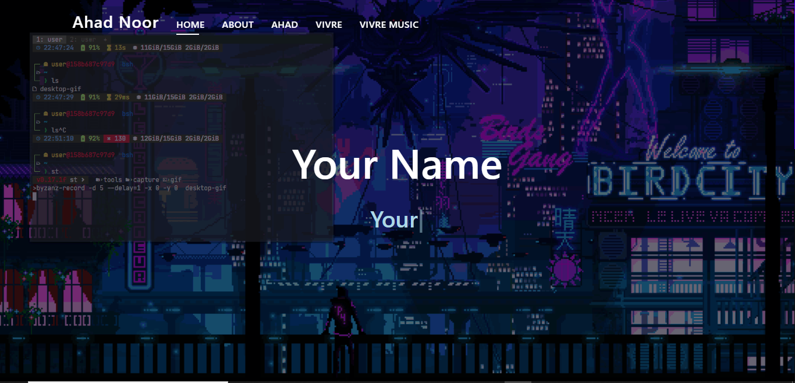

# Simple-Portfolio
A portfolio website made with ❤ by Ahad#3257

# How To Use?
It's very simple just follow the steps written below.

Type `pip install -r requirements` to install all required modules

Type `py manage.py runserver` in console to run localhost server.

You can host it on heroku easiy just connect your repo to heroku app and start worker process in resources tab.
***

***

# Note:
Use it but please give credits to author.

Skidding this code is not allowed if you see anyone taking credits of this script dm me on discord.

# Social Media:
[Instagram](https://www.instagram.com/ahadnoor._) ・
[Discord](https://discord.gg/Ncsc5pRNgf) ・
[Website](https://www.itscruel.cf/) 

# Discord: Ahad#3257
If you liked this repo please don't forget to give it a star it would mean a lot.
